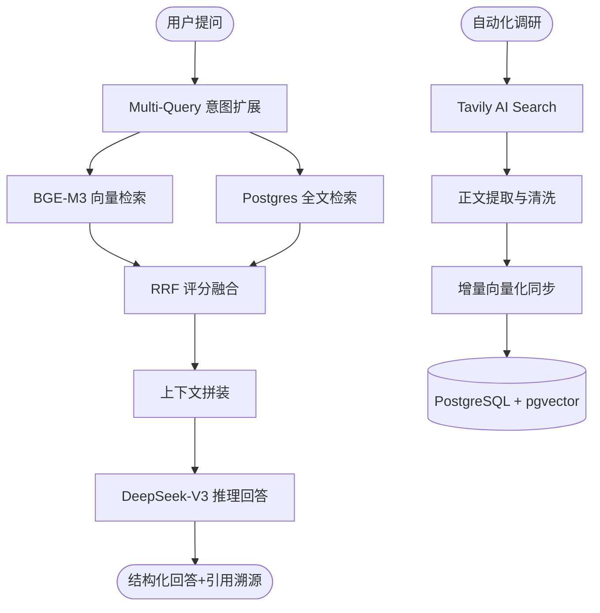

# 🧠 Enterprise Knowledge Base (进阶版 RAG 企业智脑)

[](https://www.python.org/)
[](https://nextjs.org/)
[](https://github.com/pgvector/pgvector)
[](https://api.deepseek.com)

针对企业私有知识库的进阶版 RAG (Retrieval-Augmented Generation) 系统。本项目不仅实现了基础的文档检索，还引入了 **自动化调研 Agent**、**混合检索 (Hybrid Search)** 以及 **自动化量化评测体系**，旨在解决生产环境下 RAG 系统的召回率低下、信息滞后以及难以评估等痛点。

---

## ✨ 核心技术亮点 (Technical Highlights)

### 1. 自动化知识获取 Agent (Agentic Workflow)
集成 **Tavily AI Search** 构建自动化调研流水线。
- **自主搜索**：Agent 根据用户课题自动规划搜索关键词。
- **正文去噪**：利用 `trafilatura` 自动提取网页核心正文，过滤广告与无关干扰。
- **入库闭环**：支持从“全网检索 -> Markdown 转换 -> 人工筛选 -> 向量入库”的完整工程链路。

### 2. 混合检索架构 (Hybrid Search)
基于 **RRF (Reciprocal Rank Fusion)** 算法融合多路检索结果。
- **向量检索**：使用 **BGE-M3** 多语言模型捕获语义。
- **关键词检索**：利用 Postgres `tsvector` 实现精确匹配，解决专有名词、型号、人名搜不到的问题。
- **意图扩展**：集成 **Multi-Query** 机制，自动将用户查询扩展为多路维度，显著提升检索上限。

### 3. 自动化量化评测体系 (RAG Evaluation)
自带 **自研评测引擎**，实现从“黑盒调优”到“数据驱动”的转变。
- **合成测试集**：基于现有文档自动生成 (Question, Ground-Truth) 对。
- **性能跑分**：量化监测 **Recall@K** 核心指标，一键生成检索质量报告。

---

## 🏗️ 系统架构



---

## 🛠️ 技术栈

| 层级 | 技术实现 | 备注 |
| :--- | :--- | :--- |
| **前端** | Next.js 16 + React + Tailwind + Framer Motion | 沉浸式 UI / 流式响应 |
| **后端** | FastAPI + SQLAlchemy + Pydantic | 高性能异步架构 |
| **向量库** | PostgreSQL + **pgvector** | 支持 HNSW 索引的高性能搜索 |
| **Embedding** | **BGE-M3** (via Ollama) | 多语言、长文本友好 |
| **LLM** | **DeepSeek-Chat (V3)** | 极高性价比的推理引擎 |
| **数据采集** | Tavily AI + Trafilatura | 专业 RAG 搜索与清洗 |

---

## 🚀 快速开始

### 1. 环境准备
确保已安装 **Docker** 和 **Ollama**。

```bash
# 拉取并运行嵌入模型
ollama pull bge-m3
```

### 2. 配置环境变量
修改根目录下的 `.env` 文件：

```env
DEEPSEEK_API_KEY=your_deepseek_key
TAVILY_API_KEY=your_tavily_key
DEEPSEEK_BASE_URL=https://api.deepseek.com
```

### 3. 一键启动
项目已完全容器化，使用 Docker Compose 即可启动全栈服务：

```bash
docker-compose up -d --build
```

访问 [http://localhost:3000](http://localhost:3000) 即可使用。

---

## 📈 效果评估

你可以通过以下接口直接运行自动化评测：
```bash
curl -X GET "http://localhost:8000/api/documents/evaluate?n=10"
```
系统会基于库内文档随机生成 10 组用例并返回 Recall 分数。

---

## 📁 目录说明

- `backend/services/web_researcher.py`: 调研 Agent 核心实现
- `backend/services/chat_service.py`: 混合检索与 RRF 逻辑
- `backend/services/evaluator.py`: 自动化评测引擎
- `frontend/src/components/ResearchPanel.tsx`: 调研与同步 UI 交互层
